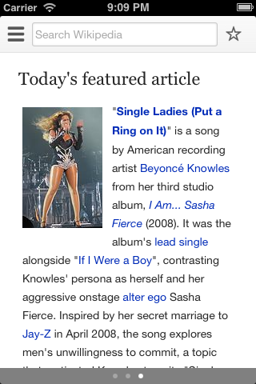
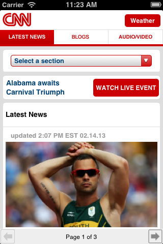
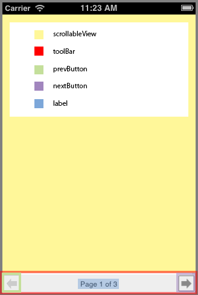

# ScrollableWebView Widget Sample

The **ScrollableWebView** widget provides a convenience container for multiple [WebViews](http://docs.appcelerator.com/titanium/latest/#!/api/Titanium.UI.WebView) within a [ScrollableView](http://docs.appcelerator.com/titanium/latest/#!/api/Titanium.UI.ScrollableView).




On iPhone and iPad, a native Paging Control is used to show how many pages are in the ScrollableView. On Android, a tool bar with previous and next buttons is displayed. You can override the native look on iOS to present a tool bar experience if desired. 

## Manifest
* Version: 1.0 (stable)
* Github: https://www.github.com/orthlieb/widget_scrollablewebview
* License: [Apache 2.0](http://www.apache.org/licenses/LICENSE-2.0.html)
* Author: Carl Orthlieb
* Supported Platforms: iOS (iPhone/iPad), Android

## Adding the ScrollableWebView Widget to Your Alloy Project

* In your application's config.json file you will want to include the following line in your dependencies:

```
"dependencies": {
    "com.orthlieb.scrollablewebview":"1.0"
}
```

*  Create a widgets directory in your app directory if it doesn't already exist.
*  Copy the widget_scrollablewebview/widgets/com.orthlieb.scrollablewebview folder into your app/widgets directory. 

## Create a ScrollableWebView in the View
You can add a ScrollableWebView to a view by *requiring* the NavigationGroup widget. 

	<Widget id="swv" src="com.orthlieb.scrollablewebview"/>

Assign it an ID that you can use in your controller. E.g. `id="swv"` You can now access the NavigationGroup via `$.swv` in your controller. 

## Styling the Widget
You can style the widget through the parent .tss file including positional information, background color, etc. This includes any properties that are valid for a [TiUIView](http://docs.appcelerator.com/titanium/latest/#!/api/Titanium.UI.View) object. To style sub-components of the widget, including the [scrollableView](#scrollableView), [webView](#webView), [prevButton](#buttons), [nextButton](#buttons), [label](#label), and [toolbar](#toolbar), you will need to create a named sub-object with those styles within the widget style. 



See the examples below on how to style the sub-views.

### [scrollableView](id:scrollableView)

For this sub-view you can supply any valid properties of a [TiUIScrollableView](http://docs.appcelerator.com/titanium/latest/#!/api/Titanium.UI.ScrollableView) except for:

*   [showPagingControl](http://docs.appcelerator.com/titanium/latest/#!/api/Titanium.UI.ScrollableView-property-showPagingControl) which is handled via the [showPagingControl](#propsandmethods) property of the widget.
*   [currentPage](http://docs.appcelerator.com/titanium/latest/#!/api/Titanium.UI.ScrollableView-property-currentPage) which is handled via the [currentPage](#propsandmethods) property of the widget.
*   [views](http://docs.appcelerator.com/titanium/latest/#!/api/Titanium.UI.ScrollableView-property-views) which is handled via the [urlArray](#propsandmethods) property of the widget.
*   Any positional or size information. This is handled by the widget.

For example, to style the color of the iOS pageControl, you could do the following:

```
"#swv": {
    top: 0, left: 0, right: 0, bottom: 0,
    pagingControlStyle: "toolbar",
    showPagingControl: "auto",
    scrollableView: {
        pagingControlColor: "red"
    }
}
```

Note that specifying these properties is *optional*. Reasonable defaults are supplied.

### [webView](id:webView)

For this sub-view you can supply any valid properties of a [TiUIWebView](http://docs.appcelerator.com/titanium/latest/#!/api/Titanium.UI.WebView) except for:

*   [html](http://docs.appcelerator.com/titanium/latest/#!/api/Titanium.UI.ScrollableView-property-showPagingControl) which is handled via the [urlArray](#propsandmethods) property of the widget.
*   [url](http://docs.appcelerator.com/titanium/latest/#!/api/Titanium.UI.WebView-property-url) which is handled via the [urlArray](#propsandmethods) property of the widget.
*   Any positional or size information. This is handled by the widget.

For example, to disable zooming and making sure the pages of the webview do not scale to fit, you could do the following:

```
"#swv": {
    top: 0, left: 0, right: 0, bottom: 0,
    pagingControlStyle: "toolbar",
    showPagingControl: "auto",
    webView: {
        scalesPageToFit: false,
        enableZoomControls: false
    }
}
```

Note that specifying these properties is *optional*. Reasonable defaults are supplied.

### [prevButton and nextButton](id:buttons)
For this sub-view you can supply any valid properties of a [TiUIButton](http://docs.appcelerator.com/titanium/latest/#!/api/Titanium.UI.Button).

For example, to specify a different background for the previous and next buttons, you could do the following:

```
"#swv": {
    top: 0, left: 0, right: 0, bottom: 0,
    pagingControlStyle: "toolbar",
    showPagingControl: "auto",
    prevButton: {
        backgroundImage: "myprevbutton.png",
        backgroundDisabledImage: "mydisabledprevbutton.png"
    },
    nextButton: {
        backgroundImage: "mynextbutton.png",
        backgroundDisabledImage: "mydisablednextbutton.png"
    }
}
```

Note that specifying these properties is *optional*. Reasonable defaults are supplied.

### [label](id:label)
For this sub-view you can supply any valid properties of a [TiUILabel](http://docs.appcelerator.com/titanium/latest/#!/api/Titanium.UI.Label).

For example, to specify a different text color for the label, you could do the following:

```
"#swv": {
    top: 0, left: 0, right: 0, bottom: 0,
    pagingControlStyle: "toolbar",
    showPagingControl: "auto",
    label: {
        color: "white"
    }
}
```

Note that specifying these properties is *optional*. Reasonable defaults are supplied.

### [toolbar](id:toolbar)
For this sub-view you can supply any valid properties of a [TiUIView](http://docs.appcelerator.com/titanium/latest/#!/api/Titanium.UI.View) except for:

*   Any positional or size information. This is handled by the widget.


For example, to specify a background image for the toolbar, you could do the following:

```
"#swv": {
    top: 0, left: 0, right: 0, bottom: 0,
    pagingControlStyle: "toolbar",
    showPagingControl: "auto",
    toolbar: {
        backgroundImage: "mycoolbackgroundimage.png"
    }
}
```

Note that specifying these properties is *optional*. Reasonable defaults are supplied.

# [Accessible Properties and Methods](id:propsandmethods)
| Name | Type | Description | 
| ---- | ---- | ----------- |
| currentPage | *integer* | Index of the active page. |
| pagingControlStyle | *string* | Should be one of "native" or "toolbar". When "native" it displays a paging control on iOS and a toolbar on Android. When "toolbar" it uses the toolbar for both platforms for a more uniform look. Default is "native". |
| showPagingControl | *string* | Should be one of "on", "off", or "auto". When "on" the paging control is always displayed. When "off" the paging control is never displayed. When "auto" the paging control is displayed when there is more than one URL in the *urlArray*. Default is "auto". | 
| urlArray | *array* | Array of strings. If the string starts with "http" then the webview accesses a remote URL, otherwise, the widget looks for a local file in the assets/HTML folder. |


## Future Work

* Support for other platforms like Mobile Web and Blackberry.
* Add relevant events like scrolling.
* Support patterns for the label, e.g. "Page %1 of %2"


